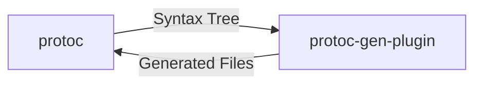

# Protoc html-doc generator

Custom `protoc` plugin for auto-generating API documentation as a static HTML/CSS/Javascript site.

## Implemented Language Features

* Message definitions
* Nested message & enum definitions
* Services
* Enums
* Comment attribution for all of the above

#### Still-to-Come:

* Indicating `oneof` fields
* Indicating `repeated` fields
* Generating multiple files and an `index.html` 

## Protoc Plugins

Protoc plugins are executable files in the filesystem which protoc invokes to generate code. Protoc interacts with the plugin through the process's `stdin` and `stdout`.



The payloads sent through `stdin` and `stdout` are themselves protocol buffers:

* `google.protobuf.compiler.plugin.CodeGeneratorRequest` contains the syntax tree
* The plugin returns a `google.protobuf.compiler.plugin.CodeGeneratorResponse` with new files to create.

#### Invoking Plugins

When you add a `--python_out=.` to your `protoc` call, protoc looks for a plugin called `protoc-gen-python` on your PATH which it will invoke and send a request to. New plugins are invoked similarly: Your new plugin must be called `protoc-gen-{something}`, exist on the PATH and your protc call must use `--{something}_out=.` to invoke it.

## Usage

1. `make init`
2. Create a `.proto` file at the project root.
3. For a proto file named `{A}.proto`, run `make html/{A}.html`
4. Run `make up` and navigate to `localhost:5000/{A}.html` in your browser.

### Other make commands

`make html/%.html` - build `%.html` from `%.proto`

`make json/%.json` - build a JSON output for the data structure built from the syntax tree

`make raw/%` - dump the raw `CodeGeneratorRequest` payload into a file

### Files

* `makedoc.py` - plugin to generate HTML doc
* `makejson.py` - plugin which creates JSON objects out of the python data structure built from the syntax tree
* `raw.py` - plugin which dumps the input `CodeGeneratorRequest` into `raw/data`

## Docstring attribution

`protoc` splits comments into three categories:

**Leading Comments** sit on the line before a node:

```protobuf
// Number of people in the house
int32 num_people = 1;
```

**Leading Detached Comments** sit before the node and are "detached", i.e. have blank lines between it and the node:

```protobuf
// Turn on the lights in a room. <-- leading detached

// Used by the TurnOnLights RPC. <-- leading
message TurnOnLightsRequest {
	...
}
```

**Trailing Comments** Sit either at the end of a node's line or directly below a node. If both exist, only the comment on-the-line is attributed as a trailing comment.

```protobuf
int32 brightness = 1; // Trailing comment 

int32 color = 2;
// Trailing comment

int32 what = 3; // Trailing Comment
// No longer a trailing comment
```

Each category seems to be assigned according to a priority:

* Leading comment
* Trailing Comment
* Leading-Detached comment

So, for example, in an ambiguous situation like this, the comment in the middle of two nodes will be attributed to the bottom:

```protobuf
message MyMessage {
	string name = 1;
	// This comment could either be a trailing for
	// 'name' or leading for 'age', but it will be
	// givent to 'age' because Leading > Trailing.
	int32 age = 2;
}
```

