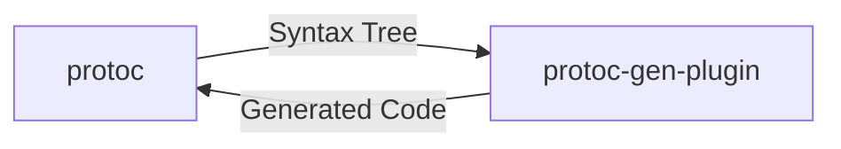

# Protoc html-doc generator

Custom `protoc` plugin for auto-generating API documentation as a static HTML/CSS/Javascript site.

## Protoc Plugins

Protoc plugins are executable files in the filesystem which protoc invokes to generate code. Protoc interacts with the plugin through the process's `stdin` and `stdout`.

The payloads sent through `stdin` and `stdout` are themselves protocol buffers:

* `google.protobuf.compiler.plugin.CodeGeneratorRequest` contains the syntax tree
* The plugin returns a `google.protobuf.compiler.plugin.CodeGeneratorResponse` with new files to create.

#### Invoking Plugins

When you add a `--python_out=.` to your `protoc` call, protoc looks for a plugin called `protoc-gen-python` on your PATH which it will invoke and send a request to. New plugins are invoked similarly: Your new plugin must be called `protoc-gen-{something}`, exist on the PATH and your protc call must use `--{something}_out=.` to invoke it.

## Usage

1. `make init`
2. Create a `.proto` file at the project root.
3. For a proto file named `{A}.proto`, run `make html/{A}.html`
4. Run `make up` and navigate to `localhost:5000/{A}.html` in your browser.